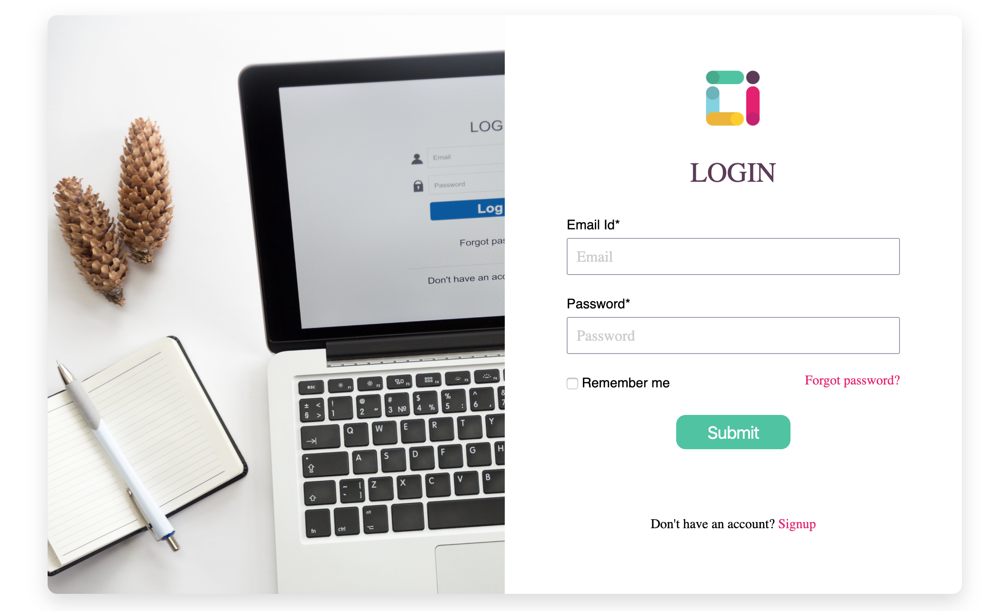

# Cyboinsect Keycloak Theme

## Overview

The [Cyboinsect](https://github.com/harshcrop) uses [Keycloak](https://www.keycloak.org/).  Out of the box, the UI provided by Keycloak is 
quite different from the rest of Theme I Build.  But Keycloak allows a customer to provide alternative themes to replace the default
Keycloak themes.  We use this mechanism to provide an Cyboinsect theme.

## Design

The following themes can be replaced.
 
* login
* regitser
* forgot-password
* change password
* admin
 
This projects contains a theme that can be used to replace the login theme to provide
an experience that is consistent with Cyboisect.  

## Implementation

Since Keycloak supports Freemarker, [a template file](./theme/login/login.ftl) is provided along with 
[css styles](./theme/login/resources/css/login.css) and [images](./theme/login/resources/img).

### Deployment to a standalone Keycloak server
1. After installing Keycloak, navigate to the themes directory as in e.g.
```
 ~/development/keycloak-8.0.0.Final/themes
 ```
2. Create a directory named *Cyboinsect*.  
3. Copy the *login* directory from this project to a *login* directory in the Alfresco theme directory you 
just created
4. Start Keycloak


## Using the Theme 
**NOTE**: These instructions assume you are using a Keycloak realm named *cyboinsect* such as is 
created by the [Cyboinsect Team](https://github.com/harshcrop/).  But you can also apply the theme to the *default* realm or some other realm.
1. Navigate to the admin console for the realm as in e.g. 
```
http://localhost/auth/admin/master/console/#/realms/cyboinsect
```
2. Choose the *Cyboinsect*
theme as [illustrated](./screen-captures/login.png).  Click *Save*.
3. Login to a page in the *Cyboinsect* realm that requires authentication (e.g. http://localhost/auth/realms/cyboinsect/account) and
you should see a form like this.  




## More Information

If you want to learn more about how to customize Keycloak themes, go [here](https://www.keycloak.org/docs/4.8/server_development/#_themes).
